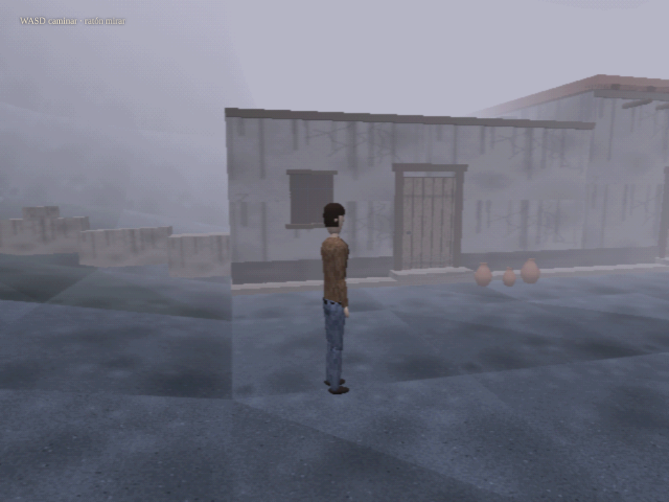
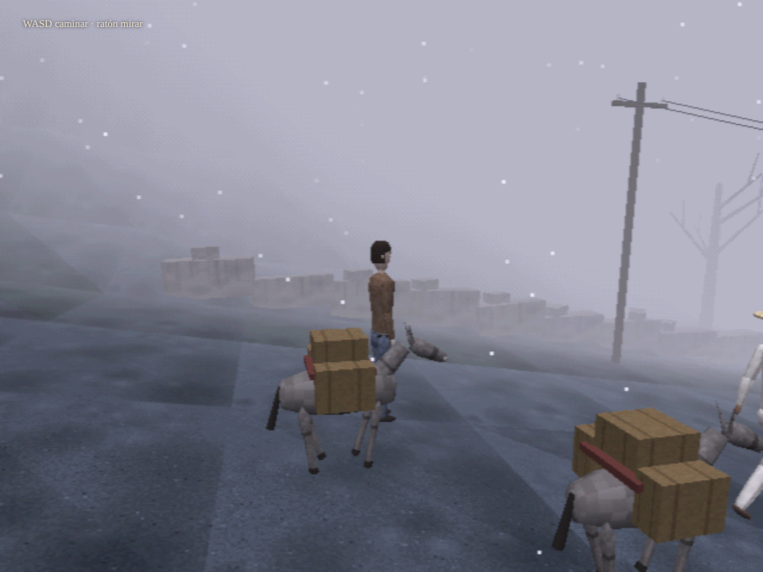
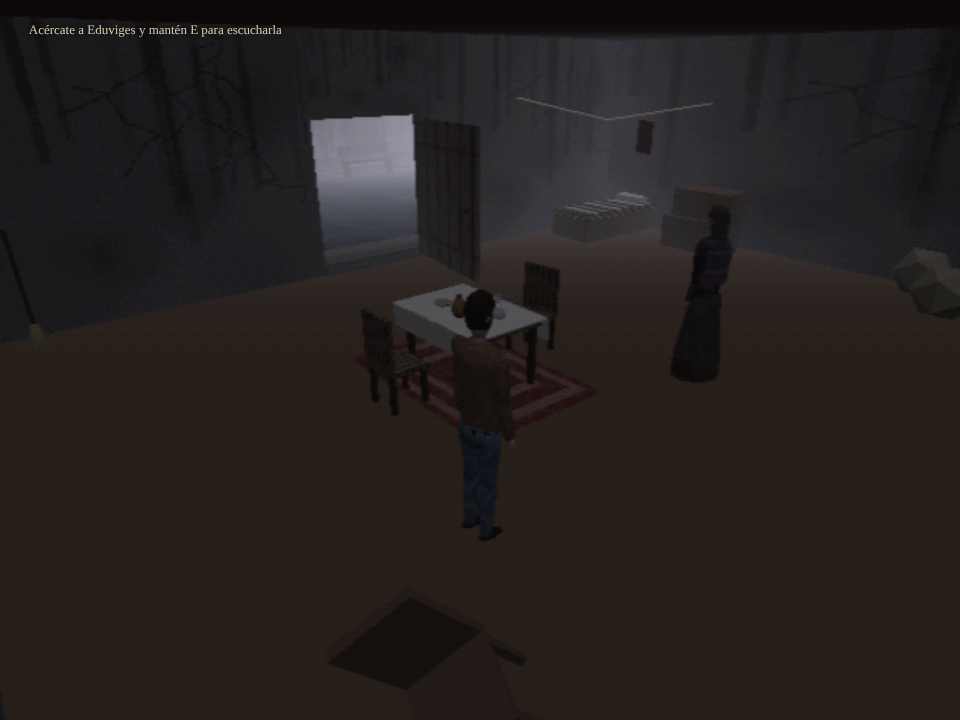
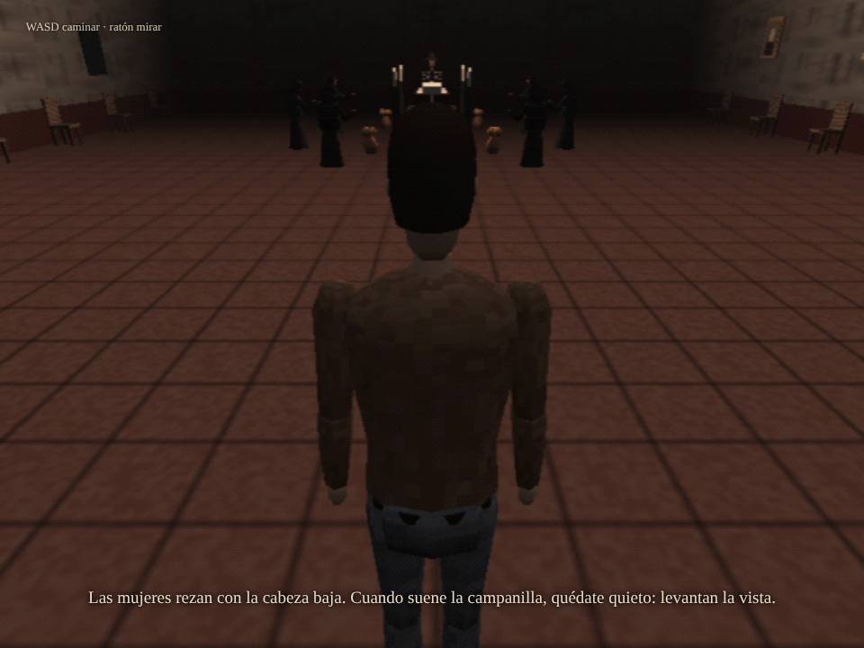
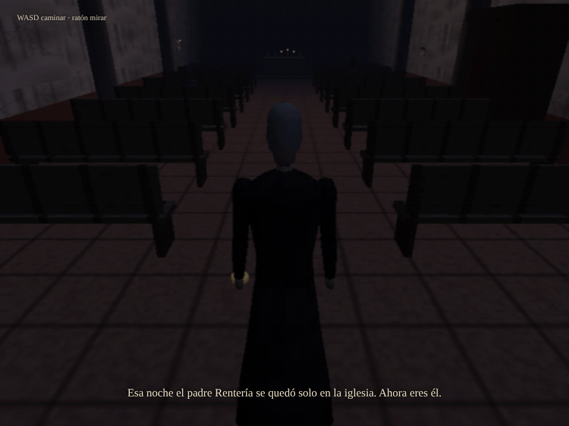
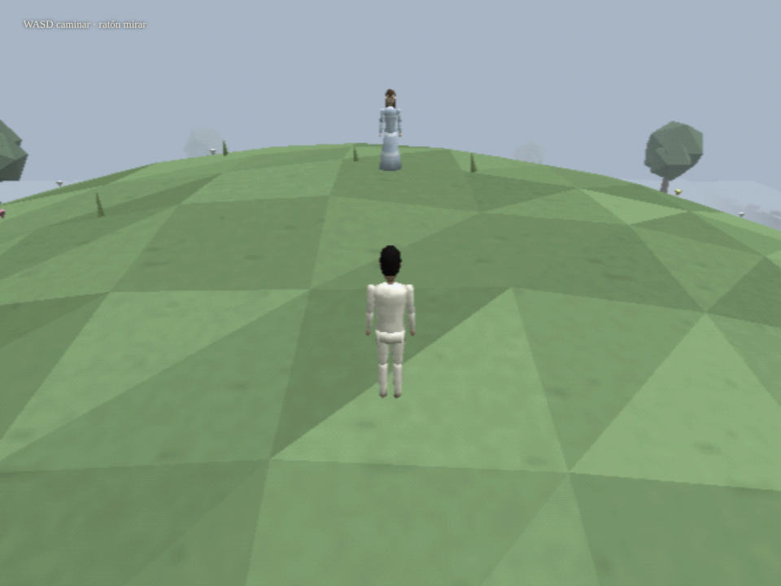
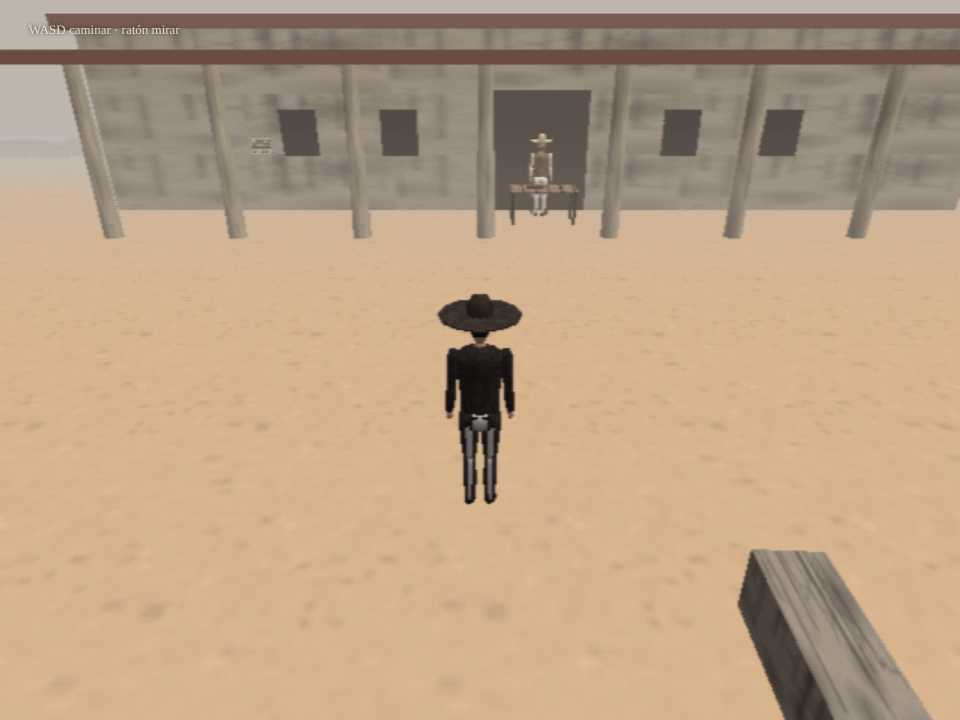
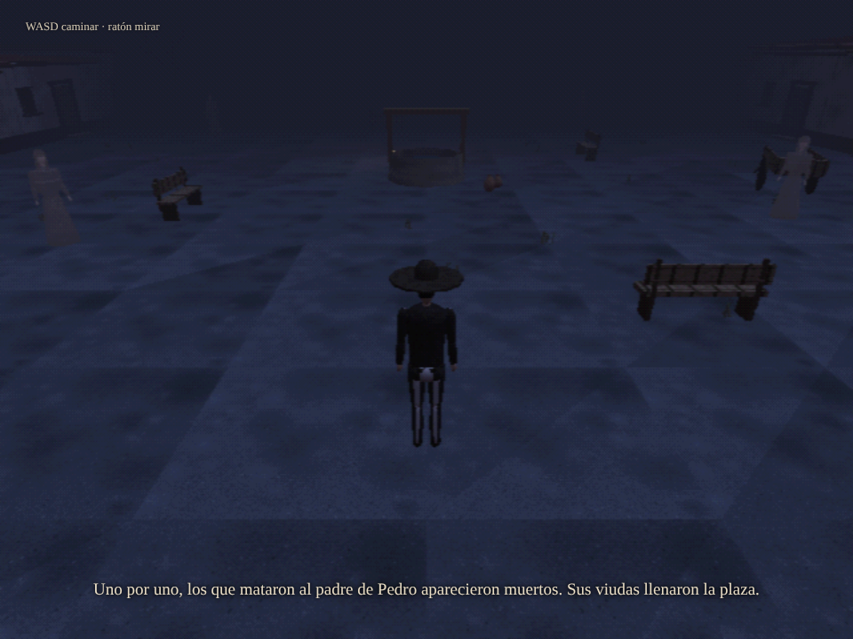
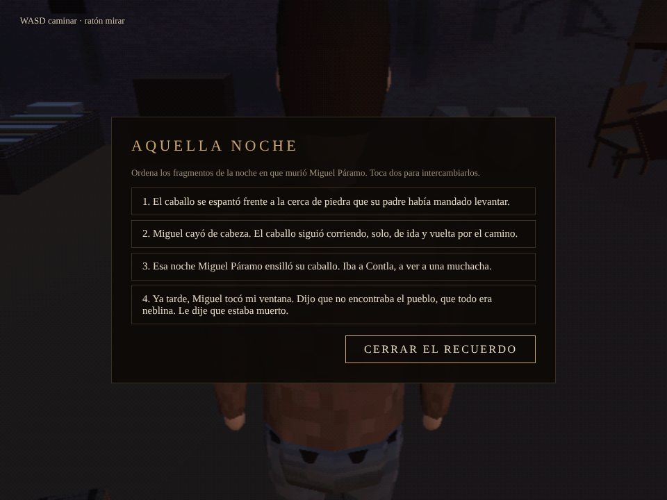

# Pedro Páramo · Survival horror PS1

> *Vine a Comala porque me dijeron que acá vivía mi padre, un tal Pedro Páramo.*

Videojuego basado en **Pedro Páramo**, la novela de Juan Rulfo (1955), contada como un survival horror de la primera PlayStation al estilo de *Silent Hill* (1999): polígonos mínimos, niebla, voces que murmuran y un pueblo donde todos están muertos.

**Web:** https://pedro-paramo.vercel.app · **Jugar en el navegador:** https://pedro-paramo.vercel.app/jugar

Disponible en **español, catalán e inglés**, con voces generadas en local. Usa auriculares.

**English:** a free browser game based on *Pedro Páramo*, Juan Rulfo's 1955 novel, told as a first-PlayStation survival horror in the style of *Silent Hill*: low poly, fog and whispering voices in a town where everyone is dead. Twelve chapters, fully voiced in Spanish, Catalan and English. [Play in English](https://pedro-paramo.vercel.app/jugar?lang=en) · [website](https://pedro-paramo.vercel.app/en/).

**Català:** un videojoc gratuït de navegador basat en *Pedro Páramo*, la novel·la de Juan Rulfo, explicat com un survival horror de la primera PlayStation a l'estil de *Silent Hill*. Dotze capítols amb veus en català, castellà i anglès. [Juga en català](https://pedro-paramo.vercel.app/jugar?lang=ca) · [web](https://pedro-paramo.vercel.app/ca/).



## Qué se juega

Doce capítulos, cada uno con una forma distinta de jugar:

| Capítulo | Qué cuenta | Cómo se juega |
| --- | --- | --- |
| 1. El camino | Juan baja a Comala con Abundio, el arriero. | Caminar bajo el sol. El calor te quita el aliento; si caes, dejas un eco que repite tus pasos. |
| 2. La casa de Eduviges | Eduviges le cuenta la noche en que murió Miguel Páramo. | Escuchar las voces del pueblo manteniendo E. De noche, el pasado; ordenar los recuerdos. |
| 3. Miguel Páramo | El velorio, el padre Rentería y las monedas. | Sigilo amable en el velorio, jugar como Rentería y buscar las monedas en el retablo. |
| 4. La infancia de Pedro | Pedro niño, Susana, los papalotes y la puerta. | Pensar para viajar, volar un papalote al ritmo del viento y seguirlo hasta casa. |
| 5. La Media Luna | Pedro se hace dueño de todo. | Una elección que no es elección, una cerca que te sigue y una plaza que hay que callar. |
| 6. Damiana | Damiana Cisneros lleva a Juan por el pueblo de noche. | Seguir la luz de su farol: fuera de ella el aire se acaba antes. |
| 7. Donis y su hermana | Los hermanos, el lodo y los murmullos de la plaza. | Huir del lodo hasta la puerta y caminar entre los murmullos. |
| 8. La tumba | Juan, enterrado junto a Dorotea, oye a Susana San Juan. | Girar la cabeza y tirar de las voces; tirar cuesta aliento. |
| 9. Susana San Juan | La mina, el mar y las campanas. | Bajar a Susana por la cuerda, perseguir una cama que se aleja y callar una fiesta. |
| 10. La Revolución | Los alzados llegan a la Media Luna. | Esconderse de los jinetes tras las piedras; si te ven, vuelves a la última. |
| 11. Comala se muere de hambre | Pedro se cruza de brazos. | No hacer nada mientras el pueblo se vacía a tu paso. |
| 12. El final | Abundio y Pedro Páramo. | Recordar sentado, una última elección y unos últimos pasos. |

Hay secretos escondidos para quien conozca los juegos de 1999, y un final que conviene no leer antes de jugar.

La partida se guarda sola en el navegador al empezar cada capítulo; al abrir el juego puedes elegir entre continuar o empezar una partida nueva.

| | |
| --- | --- |
|  |  |
|  |  |
|  |  |
|  |  |

## Controles

| Tecla | Acción |
| --- | --- |
| WASD | Caminar |
| Ratón | Mirar (clic para capturar el puntero) |
| Shift | Correr (solo dentro del pueblo, y marea) |
| Mantener E | Escuchar, pensar, callar |
| Pulsar E | Usar o leer |
| Tab | Abrir el libro de fragmentos |
| A/D o ratón | Girar la cabeza en la tumba |
| Mantener Esc | Menú: pausa, opciones y controles |

## Jugar en local

Las voces se cargan con `fetch`, así que el juego necesita un servidor, no basta con abrir el archivo:

```bash
npx serve .
```

y abre la dirección que indique: la portada en `/` y el juego en `/jugar`.

## Cómo está hecho

- Un solo `jugar.html` con [three.js r128](https://threejs.org/): render a 640×480, vértices que tiemblan como en PS1, dithering de 15 bits, niebla y ondas de calor en un shader de postproceso.
- Personajes y animales modelados por código con tornos y cajas; texturas pintadas en canvas.
- Ambiente, pasos, viento y murmullos sintetizados con Web Audio; las voces de los fragmentos suenan en 3D.
- Voces: castellano con [Kokoro](https://github.com/thewh1teagle/kokoro-onnx); catalán e inglés con [Piper](https://github.com/rhasspy/piper). Todo generado en local.

```
index.html          la web (portada, novela, personajes, Rulfo), también ca/ y en/
jugar.html          el juego
web/                estilos, script e imágenes de la web
audio/es|ca|en/     voces de cada idioma
fuente/             piezas con las que se generan el juego y la web (ver abajo)
pruebas/            prueba automática de momentos
docs/               capturas y notas de diseño
```

### Editar el juego

`jugar.html` se genera a partir de `fuente/`: la base de los capítulos 1 y 2 (`index_v070.html`), los capítulos 3 a 5 y las correcciones (`ch_main.js`, `ch_update.js`, `ch_i18n.js`) y los capítulos 6 a 12, el guardado y los créditos (`ch_end.js`, `ch_i18n2.js`). Edita esas piezas y regenera:

```bash
python3 fuente/patch8.py
```

### Editar la web

La portada en los tres idiomas (`index.html`, `ca/index.html`, `en/index.html`) y `sitemap.xml` se generan desde `fuente/web.py` con los textos de `fuente/web_es.py`, `web_ca.py` y `web_en.py`:

```bash
python3 fuente/web.py
```

### Pruebas

```bash
npm i playwright && npx playwright install chromium
node pruebas/probar-momentos.js                 # abre cada momento y guarda una captura
LANGS=es,ca,en node pruebas/probar-momentos.js  # en los tres idiomas
```

Los momentos de cada capítulo se abren desde el menú añadiendo `?admin=true` a la dirección. En `fuente/pruebas-dev/` hay jugadores automáticos (`auto.js` y `auto9.js`, para los capítulos 6 a 12) que recorre el juego siguiendo los objetivos y avisa si se atasca o cae.

## Créditos

- **Obra original:** *Pedro Páramo*, de Juan Rulfo (1955).
- **Diseño, código, arte, sonido y voces:** Claude (Anthropic).
- **AI engineer:** Santiago ([@yeagob](https://github.com/yeagob)), que hizo de puente entre Claude y la obra.

Proyecto de fans sin ánimo de lucro. *Pedro Páramo* es obra de Juan Rulfo; los fragmentos citados pertenecen a sus herederos.
